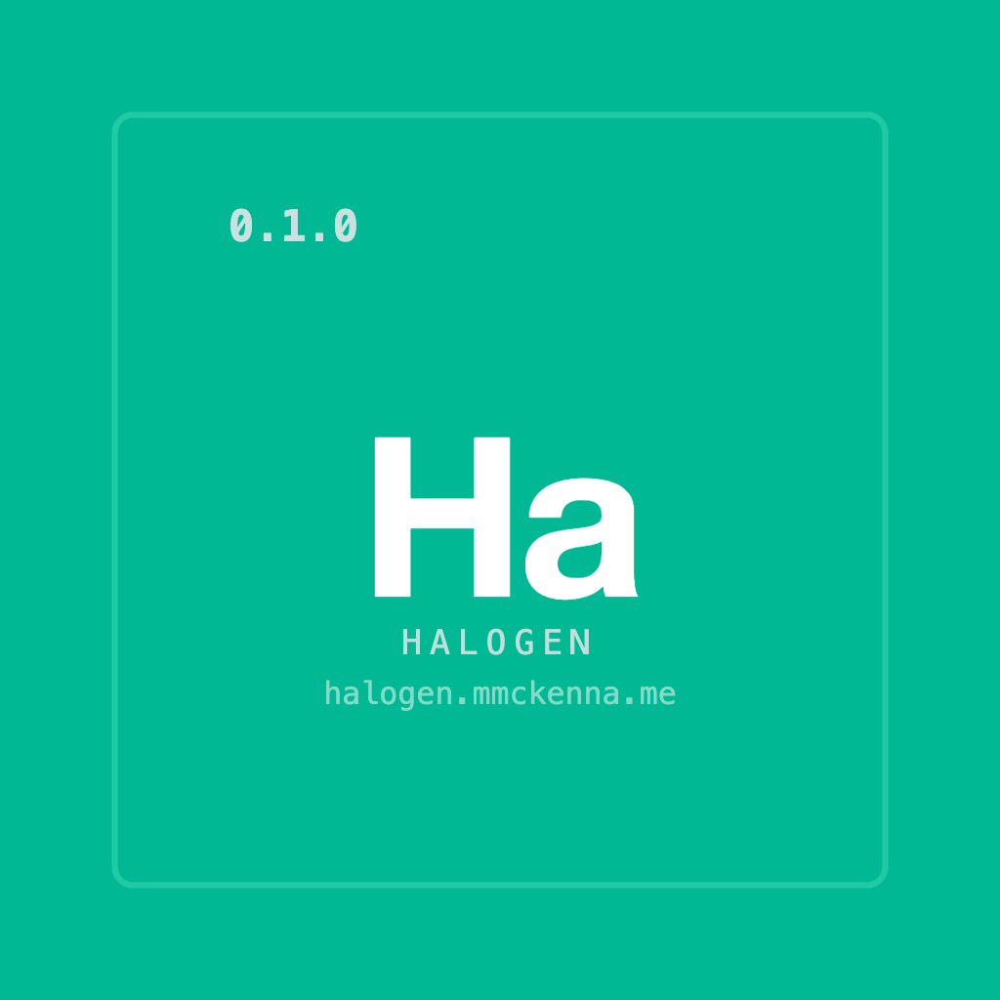

<p align="center">
  
</p>

# Halogen

**Runtime theme generation for [Compose Multiplatform](https://www.jetbrains.com/compose-multiplatform/)**

[](https://github.com/himattm/halogen/actions/workflows/ci.yml)
[](https://central.sonatype.com/namespace/me.mmckenna.halogen)
[](https://www.apache.org/licenses/LICENSE-2.0)
[](https://kotlinlang.org)
[](https://halogen.mmckenna.me/latest/)

Halogen turns natural language into complete [Material 3](https://m3.material.io) themes at runtime. Give it a prompt like "warm coffee shop" or "neon cyberpunk" and it generates colors, typography, and shapes, all cached so the LLM only runs once per prompt.

On Android, it can run entirely on-device with [Gemini Nano](https://developer.android.com/ai/gemini-nano). On iOS, Desktop, and Web, plug in any cloud LLM.

<div align="center">

https://github.com/user-attachments/assets/d744b0db-8179-4bc0-89c8-1c7318533c78

</div>

### Imagine

- A **weather app** where the entire UI shifts to match the forecast - sunny yellows, stormy grays, sunset gradients
- A **community platform** where every subreddit, channel, or group gets its own generated look and feel
- A **music player** that themes itself to the album art or genre - jazz gets warm tones, electronic gets neon
- An **e-commerce app** where each brand or product category has a distinct visual identity, generated on the fly
- A **reading app** that adapts its palette to the mood of the content - thriller, romance, sci-fi

Halogen makes all of this possible with a single `resolve()` call.

## Quick Start

```kotlin
// 1. Build the engine
val halogen = Halogen.Builder()
    .provider(GeminiNanoProvider())
    .cache(HalogenCache.memory())
    .build()

// 2. Generate a theme
halogen.resolve(key = "coffee", hint = "warm coffee shop vibes")

// 3. Apply it
HalogenTheme { App() }
```

That's three lines to go from a text prompt to a full Material 3 theme. See the [Quick Start guide](https://halogen.mmckenna.me/latest/quick-start/) for setup details.

## Installation

Most apps need three modules:

```kotlin
implementation("me.mmckenna.halogen:halogen-core:0.1.0")
implementation("me.mmckenna.halogen:halogen-compose:0.1.0")
implementation("me.mmckenna.halogen:halogen-engine:0.1.0")
```

Then add a provider and optionally a persistent cache:

```kotlin
// Gemini Nano on-device provider (Android only, min SDK 26)
implementation("me.mmckenna.halogen:halogen-provider-nano:0.1.0")

// Room KMP persistent cache (Android, iOS, JVM - not wasmJs)
implementation("me.mmckenna.halogen:halogen-cache-room:0.1.0")
```

## How It Works

The LLM generates 6 seed colors + typography/shape hints. Halogen expands those into 49 M3 color roles, 15 text styles, and 5 shape sizes using pure-Kotlin [HCT color science](https://material.io/blog/science-of-color-design). One call produces both light and dark schemes - toggling dark mode is instant, no second LLM call.

```
resolve("coffee", "warm coffee shop")
    → cache HIT?  → return instantly
    → cache MISS? → LLM generates seeds → expand to full M3 theme → cache → apply
```

Results are cached by key, so the LLM is never called twice for the same prompt.

## Configuration Presets

Control how seed colors get expanded into palettes:

| Preset | Style |
|--------|-------|
| `Default` | Balanced M3 tonal spot - good for most apps |
| `Vibrant` | Bolder, more saturated |
| `Muted` | Desaturated, calm |
| `Monochrome` | Single-hue variations |
| `Punchy` | High-energy, high-contrast |
| `Pastel` | Soft and airy |
| `Editorial` | Strong primary, neutral everything else |
| `Expressive` | Colorful - even the neutrals are tinted |

```kotlin
Halogen.Builder()
    .provider(myProvider)
    .config(HalogenConfig.Vibrant)
    .build()
```

All presets are in `HalogenConfig.presets` if you want to build a UI picker.

## Platform Support

| Platform | LLM Provider | Persistent Cache |
|----------|-------------|------------------|
| Android | Gemini Nano (on-device) or cloud | Room |
| iOS | Cloud providers | Room |
| Desktop (JVM) | Cloud providers | Room |
| Web (WasmJs) | Cloud providers | - |

All platforms get in-memory LRU caching and full Compose Material 3 support.

## Custom Design Systems

Halogen wraps `MaterialTheme` by default, but the core types are just numbers: ARGB ints, font weights, dp values. Map them to anything:

```kotlin
HalogenTheme(
    spec = currentSpec,
    themeWrapper = { expanded, isDark, content ->
        CompositionLocalProvider(LocalMyTheme provides expanded.toMyTheme(isDark)) {
            content()
        }
    },
) { App() }
```

## Samples

| Sample | Platform | Description |
|--------|----------|-------------|
| [`sample/`](sample/) | Android | Playground, weather themes, test harness, settings |
| [`sample-shared/`](sample-shared/) | Android, iOS, Desktop, Web | KMP sample with cloud LLM providers |

## Docs

Full documentation at [halogen.mmckenna.me](https://halogen.mmckenna.me/latest/):

[Quick Start](https://halogen.mmckenna.me/latest/quick-start/) ·
[Architecture](https://halogen.mmckenna.me/latest/architecture/) ·
[Provider Guide](https://halogen.mmckenna.me/latest/provider-guide/) ·
[Custom Extensions](https://halogen.mmckenna.me/latest/custom-extensions/) ·
[Custom Theme Systems](https://halogen.mmckenna.me/latest/custom-theme-systems/) ·
[API Reference](https://halogen.mmckenna.me/latest/api-reference/) ·
[Design Decisions](https://halogen.mmckenna.me/latest/design-decisions/)

## Compatibility

| Dependency | Version |
|-----------|---------|
| Kotlin | 2.2.20 |
| Compose Multiplatform | 1.10.1 |
| Android Gradle Plugin | 8.13.2 |
| Min Android SDK | 24 (Nano: 26) |
| JVM Target | 17 |

## Contributing

See [CONTRIBUTING.md](CONTRIBUTING.md) for development setup, code style, and PR guidelines.

## License

```
Copyright 2025-2026 Matt McKenna

Licensed under the Apache License, Version 2.0 (the "License");
you may not use this file except in compliance with the License.
You may obtain a copy of the License at

    http://www.apache.org/licenses/LICENSE-2.0

Unless required by applicable law or agreed to in writing, software
distributed under the License is distributed on an "AS IS" BASIS,
WITHOUT WARRANTIES OR CONDITIONS OF ANY KIND, either express or implied.
See the License for the specific language governing permissions and
limitations under the License.
```
