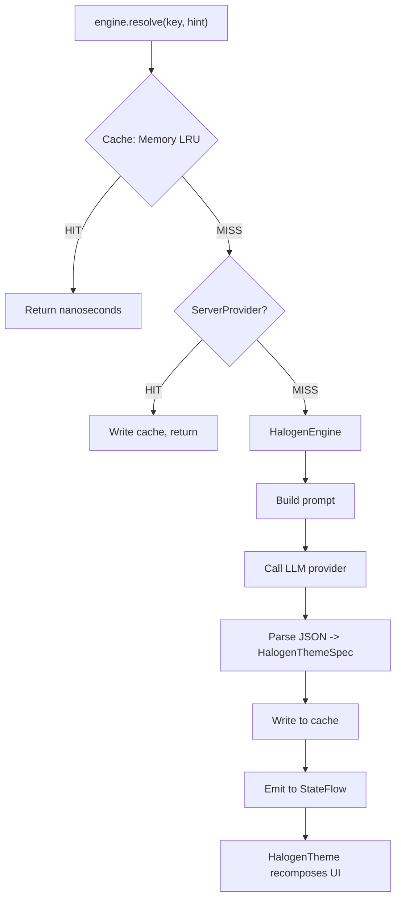
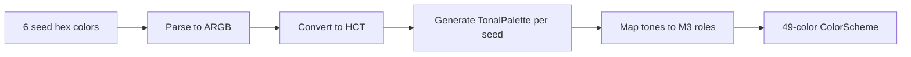

# Architecture

How Halogen transforms a natural language prompt into a full Material 3 theme.

---

## Overview

The resolve chain follows a strict priority order: cache, server, LLM, default.



Key principles:

1. **The LLM generates seeds, not the full palette.** 6 seed colors + typography/shape hints. The library expands seeds into 49 color roles using HCT tonal palettes.
2. **Themes are keyed.** Any string — a route, a category, a brand — maps to a cached theme. The LLM is called once per key, ever.
3. **Server themes take priority over LLM.** If you have a backend that defines themes, those are used first. The LLM is the fallback for unknown contexts.
4. **The LLM is pluggable.** `HalogenLlmProvider` is an interface. No hard dependency on any LLM SDK.

---

## Module Structure

Halogen is split into four artifacts with clear dependency boundaries:

```
halogen-core          (pure Kotlin, zero platform dependencies)
  |
  +-- HalogenThemeSpec, HalogenLlmProvider, HalogenColorScheme
  +-- Color science: HCT, CAM16, tonal palettes
  +-- Accessibility: WCAG contrast validation
  |
halogen-engine        (depends on core)
  |
  +-- HalogenEngine, Halogen.Builder
  +-- In-memory LRU cache
  +-- Prompt construction, JSON parsing
  +-- Provider chaining and fallback
  |
halogen-compose       (depends on core)
  |
  +-- HalogenTheme composable
  +-- HalogenSettingsCard
  +-- LocalHalogenExtensions
  |
halogen-provider-nano (depends on core, Android only)
  |
  +-- GeminiNanoProvider
  +-- ML Kit integration
```

The key architectural decision: `halogen-core` and `halogen-engine` have **zero LLM imports**. The Nano provider is a separate artifact. A developer using only cloud LLMs never pulls ML Kit.

---

## Custom Theme Systems

`halogen-core` is intentionally decoupled from Material 3. The `HalogenColorScheme`, `HalogenTypography`, and `HalogenShapes` types are pure data — ARGB integers, font weights, and dp values. They carry no Material 3 imports or dependencies.

This means you can use Halogen with any design system:

1. Use `ThemeExpander.expand(spec, config)` to get an `ExpandedTheme`
2. Map the raw values to your theme system's types
3. Optionally use `HalogenTheme` with a `themeWrapper` to integrate with Compose

See the [Custom Theme Systems](custom-theme-systems.md) guide for a complete walkthrough.

---

## Color Science

### From 6 Seeds to 49 Roles

The LLM generates 6 seed colors: primary, secondary, tertiary, neutral-light, neutral-dark, and error. Each seed is converted to HCT (Hue-Chroma-Tone) color space and expanded into a tonal palette with 13 tone levels.



**Tonal palette mapping (light mode example):**

| M3 Role | Tone |
|---------|------|
| `primary` | 40 |
| `onPrimary` | 100 |
| `primaryContainer` | 90 |
| `onPrimaryContainer` | 10 |
| `inversePrimary` | 80 |

In dark mode, the tones flip — `primary` maps to tone 80, `onPrimary` to tone 20, etc. This is why one LLM call produces both light and dark themes: the same hue and chroma are shared, only the tone mapping changes.

### HCT Color Space

Halogen includes a pure Kotlin implementation of the HCT (Hue-Chroma-Tone) color model, ported from Google's `material-color-utilities`. This avoids a JVM-only dependency and works on all KMP targets.

The pipeline: `ARGB -> XYZ -> CAM16 -> HCT -> TonalPalette -> ARGB`

---

## Caching

### In-Memory LRU

- `MemoryThemeCache`: LRU eviction with configurable max entries (default 20)
- Lookup time: nanoseconds (HashMap access)
- Lost on process death
- Web targets can use `LocalStorageThemeCache` (currently delegates to memory; full localStorage planned)

### No-Op Cache

- `HalogenCache.none()` disables caching entirely — useful for testing or always-fresh themes

### Cache Flow

1. **Cache hit** — Return immediately (nanoseconds)
2. **Cache miss, server hit** — Fetch from server provider, write to cache, return
3. **Cache miss, server miss** — Generate via LLM, write to cache, return (~1-3s)

Once a theme is generated, it lives in cache until evicted or the process ends. The LLM is never called again for the same key unless explicitly evicted.

---

## Platform Support Matrix

| Feature | Android | iOS | Desktop (JVM) | Web (WasmJs) |
|---------|---------|-----|---------------|-------------|
| halogen-core | Yes | Yes | Yes | Yes |
| halogen-engine | Yes | Yes | Yes | Yes |
| halogen-compose | Yes | Yes | Yes | Yes |
| halogen-provider-nano | Yes | -- | -- | -- |
| On-device LLM | Gemini Nano | -- | -- | -- |
| Cloud LLM | Any | Any | Any | Any |
| Cache (Memory LRU) | Yes | Yes | Yes | Yes |
| Cache (localStorage) | -- | -- | -- | Yes |
| Color science (HCT) | Yes | Yes | Yes | Yes |
